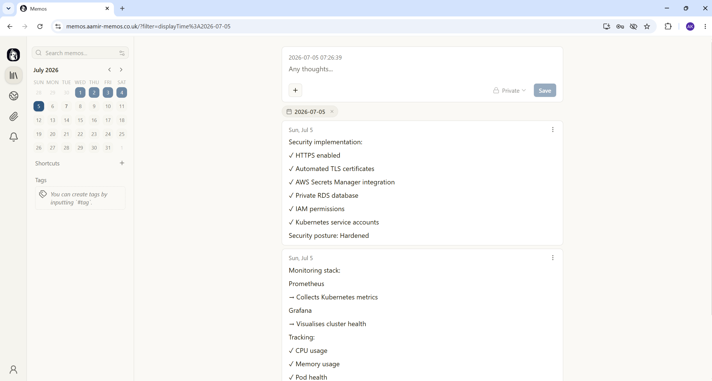
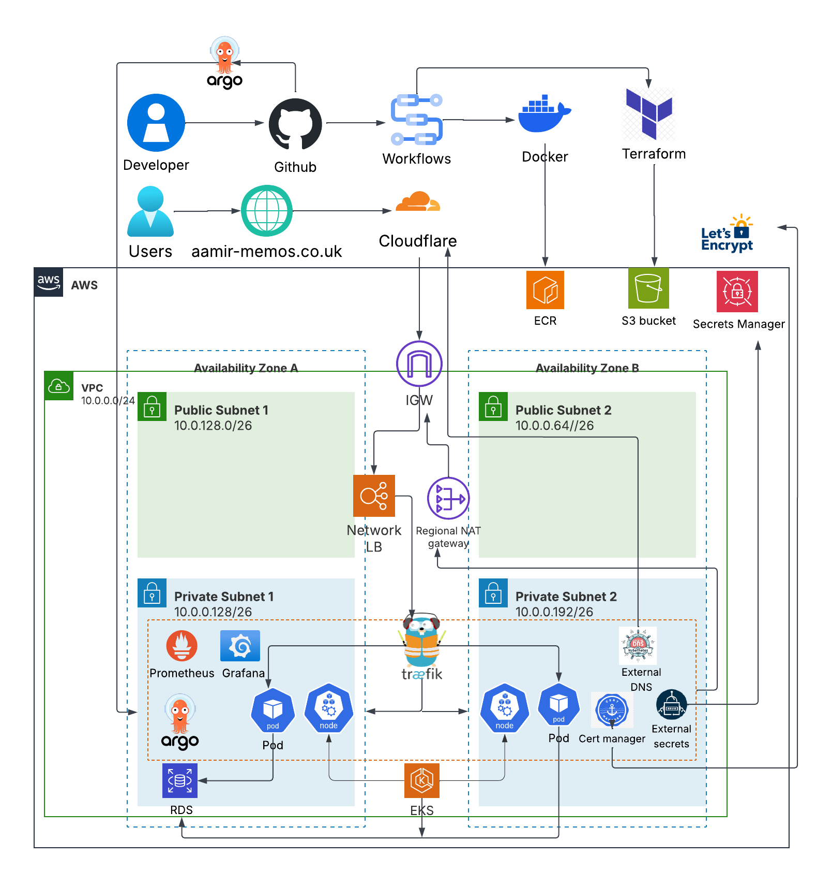
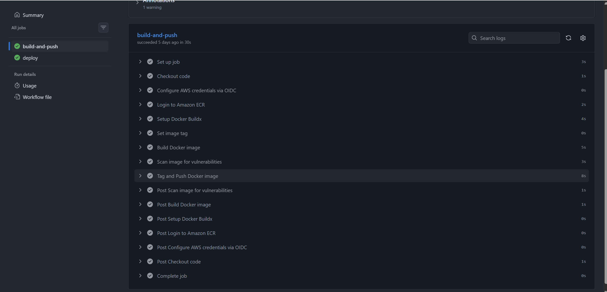
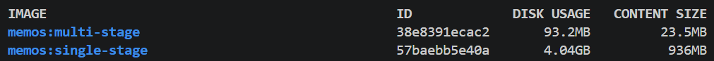
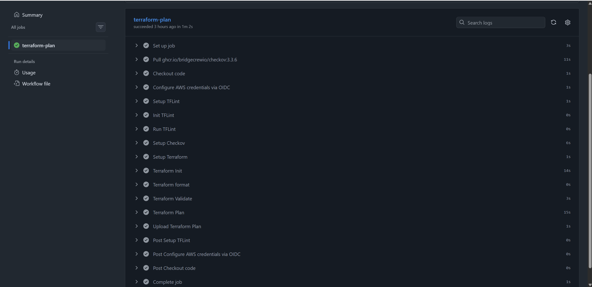
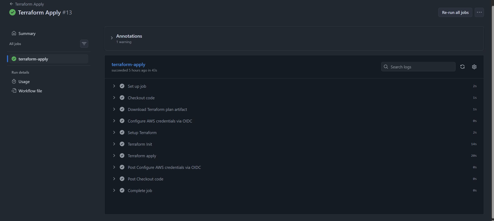
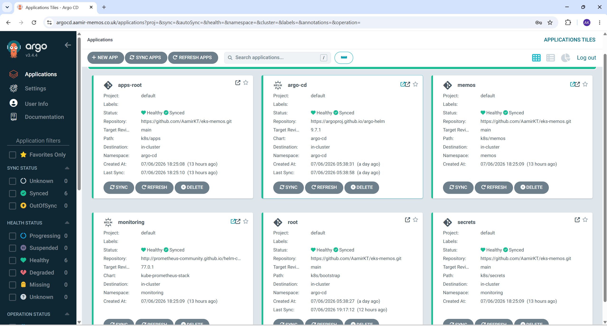
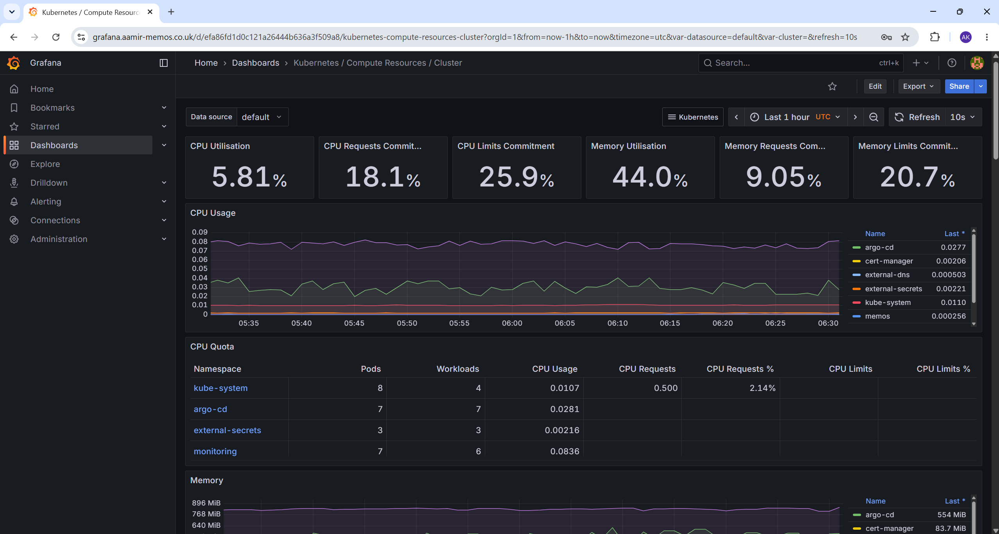

# End-to-End DevOps Deployment of Memos on Amazon EKS
---
A production-grade Kubernetes deployment demonstrating Terraform-based infrastructure provisioning, GitOps delivery with ArgoCD, automated CI/CD pipelines, AWS integrations, ingress management, secret management, TLS automation, and Kubernetes observability.

## Overview

This project demonstrates deploying a containerised application on AWS using Infrastructure as Code, Kubernetes orchestration, GitOps delivery, and automated CI/CD practices.

Terraform provisions the AWS infrastructure and installs core Kubernetes platform components using the Helm provider. Application deployments are managed through GitOps using ArgoCD, with Git acting as the single source of truth.

PostgreSQL persistence is provided by Amazon RDS, secrets are synchronised from AWS Secrets Manager using External Secrets Operator, TLS is automated using cert-manager, and cluster/application metrics are collected by Prometheus and visualised through Grafana.

The Memos application is deployed onto Amazon EKS and exposed externally through Traefik ingress with automated TLS.



---
## Architecture



The architecture separates public ingress from private workloads. User traffic enters through Cloudflare and a Network Load Balancer before reaching Traefik, Kubernetes services, and application pods. Worker nodes, Kubernetes platform components, and application workloads remain isolated within private subnets, while persistent data is managed externally through Amazon RDS PostgreSQL.

---
## Tech Stack

| Category | Technology |
|----------|------------|
| Cloud | AWS |
| Infrastructure as Code (IaC) | Terraform |
| Container Orchestration | Kubernetes (Amazon EKS) |
| GitOps | ArgoCD |
| CI/CD | GitHub Actions |
| Container Registry | Amazon ECR |
| Database | Amazon RDS PostgreSQL |
| Ingress | Traefik |
| DNS Management | Cloudflare + External DNS |
| Secrets Management | AWS Secrets Manager + External Secrets Operator |
| Monitoring & Observability | Prometheus + Grafana |

---
## Features

- Infrastructure as Code with Terraform
- Amazon EKS Kubernetes cluster
- Kubernetes Deployments, Services, Ingress, and ServiceAccounts
- Amazon RDS PostgreSQL database
- Amazon ECR container registry
- Container image vulnerability scanning with Trivy
- GitOps deployment with ArgoCD
- Automated CI/CD with GitHub Actions
- Traefik ingress controller
- Automatic TLS certificates with cert-manager
- AWS Secrets Manager integration
- Prometheus metrics
- Grafana dashboards
- Helm-based Kubernetes platform deployment
- Kubernetes observability
---
## Key Architecture Decisions

### Infrastructure as Code

Terraform manages all AWS infrastructure including networking, EKS, RDS, IAM, security groups, and Kubernetes platform components.

### GitOps Delivery

ArgoCD continuously reconciles Kubernetes manifests from Git, ensuring the cluster matches the declared desired state.

### Managed Database

Application persistence is handled through Amazon RDS PostgreSQL rather than running databases inside Kubernetes.

### Secret Management

Sensitive values are stored in AWS Secrets Manager and synchronised into Kubernetes using External Secrets Operator.

### Secure Networking

Worker nodes and application workloads run inside private subnets, with controlled outbound access through NAT Gateway.

---

## Project Structure
```
eks-memos/
│
├── README.md
│
├── .github/
│   └── workflows/
│       ├── terraform-plan.yaml
│       ├── terraform-apply.yaml
│       ├── terraform-destroy.yaml
│       └── docker-build.yaml
│
├── app/
│   └── Dockerfile
│
├── k8s/
│   │
│   ├── root-application.yaml
│   │
│   ├── apps/
│   │   ├── memos-application.yaml
│   │   ├── monitoring-application.yaml
│   │   └── secrets-application.yaml
│   │
│   ├── bootstrap/
│   │   ├── apps-root.yaml
│   │   │
│   │   ├── argocd/
│   │   │   ├── argocd-self-managed.yaml
│   │   │   └── namespace.yaml
│   │   │
│   │   └── cert-manager/
│   │       └── cert-manager.yaml
│   │
│   ├── memos/
│   │   ├── deployment.yaml
│   │   ├── service.yaml
│   │   ├── ingress.yaml
│   │   └── serviceaccount.yaml
│   │
│   └── secrets/
│       ├── external-secrets.yaml
│       ├── secret-store.yaml
│       └── grafana-secret.yaml
│
└── terraform/
    │
    ├── main.tf
    ├── provider.tf
    ├── variables.tf
    ├── outputs.tf
    │
    ├── bootstrap/
    │   ├── main.tf
    │   ├── provider.tf
    │   ├── variables.tf
    │   └── outputs.tf
    │
    └── modules/
        │
        ├── vpc/
        │   ├── main.tf
        │   ├── variables.tf
        │   └── outputs.tf
        │
        ├── eks/
        │   ├── main.tf
        │   ├── helm.tf
        │   ├── pod-identity.tf
        │   ├── variables.tf
        │   └── outputs.tf
        │
        ├── rds/
        │   ├── main.tf
        │   ├── variables.tf
        │   └── outputs.tf
        │
        └── sg/
            ├── main.tf
            ├── variables.tf
            └── outputs.tf

```
The repository separates infrastructure, Kubernetes manifests, and GitHub Actions workflows to keep provisioning, deployment, and application configuration independently manageable.

---

## Deployment Workflow

The deployment process follows an Infrastructure as Code and GitOps approach. Terraform is responsible for provisioning AWS infrastructure and installing Kubernetes platform components through Helm releases. ArgoCD continuously synchronises Kubernetes manifests from the Git repository, ensuring the cluster remains in the desired state.
 
## 1. Infrastructure

Terraform provisions:

- VPC
- Public and Private Subnets
- NAT Gateway
- Internet Gateway
- Route Tables
- EKS Cluster
- Managed Node Group
- IAM Roles
- Security Groups
- Amazon RDS
- Amazon ECR
- Secrets Manager

## 2. Kubernetes Platform Installation

After the EKS cluster and worker nodes are available, Terraform uses the Helm provider to install core Kubernetes platform services.

Helm releases are managed through Terraform, allowing Kubernetes platform components to be version controlled and deployed alongside infrastructure changes.

The following Helm releases are deployed automatically:

| Helm Release | Purpose |
|--------------|---------|
| Traefik | Ingress controller that routes external HTTP/HTTPS traffic into the cluster |
| cert-manager | Automates TLS certificate issuance and renewal using Let's Encrypt |
| External DNS | Automatically manages DNS records for Kubernetes services and ingress resources |
| External Secrets Operator | Synchronises secrets from external secret stores into Kubernetes Secrets |
| ArgoCD | GitOps continuous delivery platform for application deployment |

These platform services provide networking, security, DNS automation, secret management, and GitOps capabilities before any application workloads are deployed.

## 3. Application Deployment

The Memos application is deployed to Amazon EKS using Kubernetes manifests managed through ArgoCD.

The deployment includes:

- Kubernetes Deployment for application replicas
- Kubernetes Service for internal communication
- Ingress resource for external traffic routing
- ServiceAccount configured with AWS Pod Identity
- External Secrets integration for application configuration

Application persistence is provided by Amazon RDS PostgreSQL, keeping stateful data outside the Kubernetes cluster.

## 4. CI/CD Pipeline

The project uses GitHub Actions workflows to automate application delivery and infrastructure changes.

### Application CI Pipeline

When application code changes are pushed, GitHub Actions automatically:

1. Build Docker image
2. Authenticate with Amazon ECR
3. Push image to ECR
4. Update Kubernetes manifests with the new image version
5. ArgoCD detects the Git change and synchronises the deployment

GitHub Actions building the Docker image and pushing it to Amazon ECR



## Docker build performance

This project compares **single-stage** and **multi-stage Docker builds** for the application to demonstrate container optimisation in a production deployment.


| Build Type      | Disk Usage | Image Size | Build Time | Notes |
|-----------------|-----------|------------|------------|-------|
| **Single-stage** | 4.04 GB    | 936 MB     | 4 min 35s | Build dependencies and tooling included in final image |
| **Multi-stage**  | 93.2 MB    | 23.5 MB      | 2 min 17s | Only production runtime dependencies included ||

**Multi-stage builds offered significant improvements:**
- **Lowered disk usage by 98%**  
- **Shrunk image size by 97%**  
- **Accelerated deployment with 50% faster build time**



### Infrastructure CI Pipeline

Infrastructure changes trigger:

1. Terraform formatting and validation
2. Terraform plan generation
3. Terraform apply
4. AWS resource provisioning

GitHub Actions executing Terraform validation and generating an infrastructure deployment plan before changes are applied to AWS.



Terraform successfully provisioning AWS infrastructure and Kubernetes platform resources.



## 5. GitOps Deployment with ArgoCD

Once ArgoCD is installed by Terraform, it manages application deployments using Git as the source of truth.

ArgoCD continuously monitors Kubernetes manifests stored in the repository.

When changes are detected:

1. ArgoCD compares Git state with the current cluster state
2. Detects configuration drift
3. Applies Kubernetes manifests
4. Maintains the desired state of applications

ArgoCD manages:

- Memos application
- Monitoring stack
- Application configuration
- Kubernetes resources
  


## 6. Request flow

External traffic flows through the Kubernetes ingress layer:

```text
User
 │
 ▼
Cloudflare
 │
 ▼
Traefik LoadBalancer Service
 │
 ▼
Traefik Ingress Controller
 │
 ▼
Kubernetes Service
 │
 ▼
Memos Pods
 │
 ▼
Amazon RDS PostgreSQL
```

DNS records are automatically managed by External DNS, while TLS certificates are automatically provisioned and renewed by cert-manager.

## 7. Monitoring and Observability

The cluster includes Prometheus and Grafana for Kubernetes and application monitoring.

The monitoring stack provides visibility into:

- Node resource usage
- Pod health
- CPU and memory consumption
- Container restarts
- Application availability
- Cluster performance

Metrics are collected by Prometheus and visualised through Grafana dashboards.



## Security

Security practices implemented:

- Worker nodes deployed in private subnets with no direct public access
- HTTPS-only application access
- TLS certificates managed automatically with cert-manager
- Secrets stored in AWS Secrets Manager
- External Secrets Operator for Kubernetes secret synchronisation
- IAM least privilege permissions
- Security groups controlling network access
- PostgreSQL database isolated from public access
- Container images stored securely in Amazon ECR
- AWS Pod Identity used for Kubernetes workloads requiring AWS API access
---
## Lessons Learned

- Managing Kubernetes through GitOps simplifies deployments and configuration management.
- Separating infrastructure provisioning (Terraform) from application delivery (ArgoCD) creates a repeatable deployment workflow.
- External Secrets Operator enables secure secret management without storing sensitive values in Git.
- Helm significantly reduces the complexity of deploying and maintaining Kubernetes platform components.
- Observability is essential for operating Kubernetes workloads in production.
---

## Future Improvements

- Introduce Horizontal Pod Autoscaler (HPA) for application scaling
- Integrate Loki for centralized log aggregation
- Configure Alertmanager with Slack or email notifications
- Support multiple environments (development, staging, production)

---
## Author

**Aamir Tamuri**

[LinkedIn](https://www.linkedin.com/in/aamir-tamuri-491244349/) | [GitHub](https://github.com/AamirKT)

DevOps Engineer with a focus on AWS, Kubernetes, Terraform, GitOps, and CI/CD automation.
